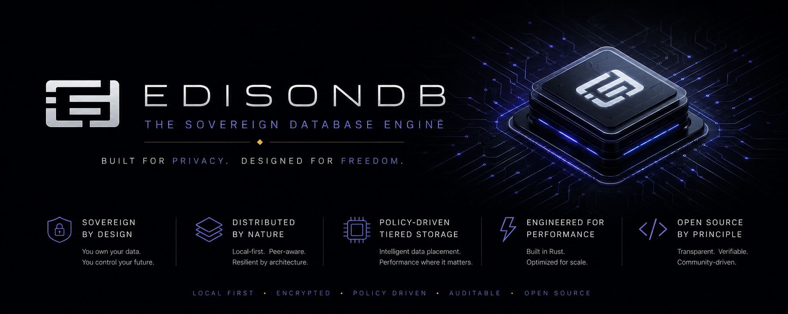
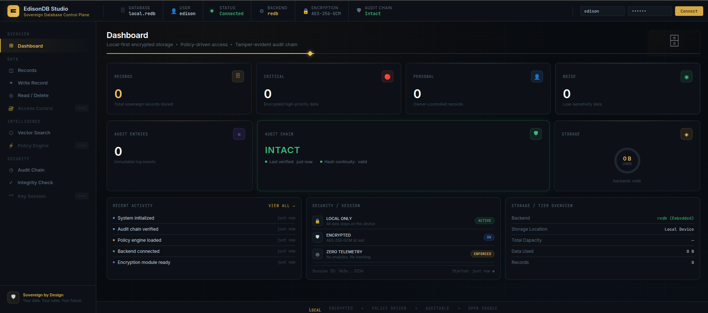
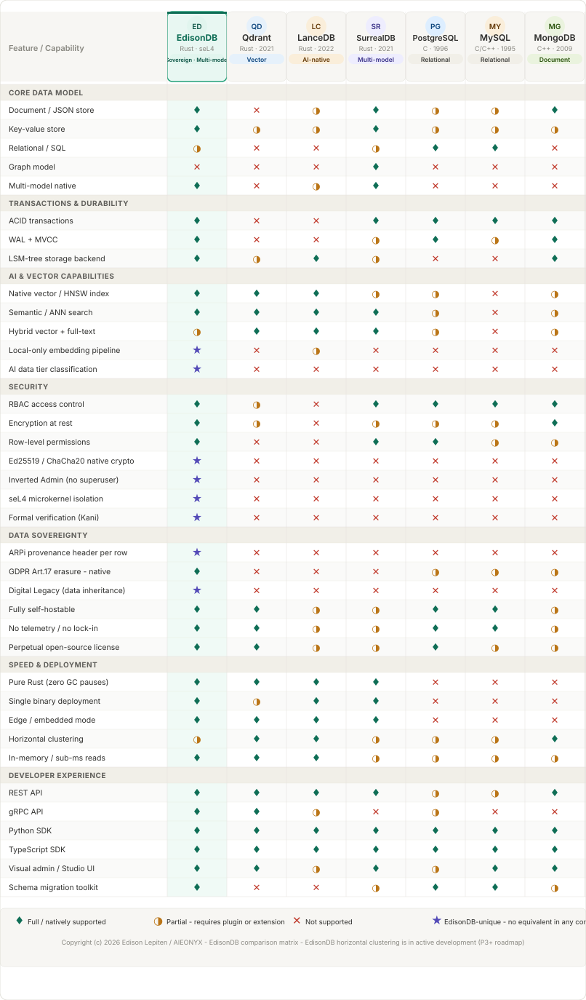

<p align="center">
  
</p>

<div align="center">


<br/><br/>

# EdisonDB

### *"Light for your data."*

**The sovereign, AI-native, multi-model database engine.**
Built in Rust. Encrypted by default. Yours forever.

<br/>

**S4+i** &nbsp;·&nbsp; Security &nbsp;·&nbsp; Speed &nbsp;·&nbsp; Sovereignty &nbsp;·&nbsp; Simplicity &nbsp;·&nbsp; Intelligence

<br/>

[Quick Start](#quick-start) · [What's New](#whats-new--phase-3-complete) · [Architecture](#architecture) · [Community Promise](#community-promise) · [Roadmap](#roadmap)

</div>

---

## What's New — Phase 3 Complete ✅

**EdisonDB v0.6.0-p3m9** — Phase 3 is complete as of June 2026.

Phase 3 delivered a production-hardened sovereign data stack on top of the Phase 2 Beta engine. All deliverables are implemented, tested, and live on GitHub.

| Phase 3 Milestone | Deliverable | Tests | Status |
|---|---|---|---|
| **P3-M1** | WAL + MVCC (fjall TxKeyspace, crash-safe) | 58 | ✅ v0.6.0-p3m1 |
| **P3-M2** | gRPC server (tonic, high-performance binary protocol) | — | ✅ |
| **P3-M4** | Sovereign offline embeddings (zero Ollama, zero network) | 20 | ✅ |
| **P3-M5** | ARPi protocol integration (78-byte provenance header) | 20 | ✅ |
| **P3-M6** | Access control + policy engine (RBAC, Inverted Admin Model) | 20 | ✅ |
| **P3-M7** | Migration toolkit (.edm format, export/import/transform) | 20 | ✅ |
| **P3-M8** | Formal verification hooks (invariants, Kani harnesses) | 20 | ✅ |
| **P3-M9** | Compliance tooling (GDPR Art.17, retention, audit report) | 20 | ✅ |
| **Total** | | **178+** | **Phase 3 complete** |

> **P3-M3 (Raft distributed consensus)** is deferred to Phase 4 — it is a distributed systems project deserving its own dedicated sprint.

---

## Current Status

**EdisonDB v0.6.0-p3m9** — production-ready sovereign database.
All Phase 2 + Phase 3 deliverables implemented, tested, and live.

### What Works Today

| Feature | Status |
|---|---|
| **EQL Query Language** — WRITE / READ / LIST / DELETE / AUDIT / EMBED / SEARCH | ✅ |
| **AES-256-GCM Encryption** — all payloads encrypted at rest, always on | ✅ |
| **Data Tier Model** — CRITICAL / PERSONAL / NOISE with Inverted Admin Model | ✅ |
| **WAL + MVCC** — crash-safe writes, fjall TxKeyspace backend | ✅ |
| **gRPC Server** — tonic, high-performance binary protocol | ✅ |
| **RBAC Policy Engine** — 5 roles, delegation with expiry, deny-override | ✅ |
| **Hash-Chained Audit Log** — tamper-evident SHA-256 chain | ✅ |
| **ARPi Provenance Header** — 78-byte wire format, data origin verification | ✅ |
| **Sovereign Offline Embeddings** — 128-dim hash projection, zero network | ✅ |
| **Ollama Auto-embedding** — local Ollama inference fallback | ✅ |
| **HNSW Vector Index** — EMBED / SEARCH EQL syntax, instant-distance | ✅ |
| **Migration Toolkit** — .edm format, export/import/transform/verify | ✅ |
| **Compliance Tooling** — GDPR Art.17 erasure, retention policy, audit report | ✅ |
| **Formal Verification Hooks** — invariant checkers, Kani harnesses | ✅ |
| **REST Server** — Axum/Tokio, 8 endpoints + /studio dashboard | ✅ |
| **Python SDK** — `pip install edisondb`, full async-ready client | ✅ |
| **TypeScript SDK** — `npm install edisondb`, full typed client | ✅ |
| **EdisonDB Studio** — sovereign dark dashboard, all panels, live data | ✅ |

### EdisonDB Studio



*Sovereign Database Control Plane — connect, browse, write, search, and verify your data locally.*

---

## Tested in Production — Onyxia v1.0.0

EdisonDB has been validated as the live data layer for **[Onyxia](https://github.com/aieonyx/onyxia)** — the AIEONYX Sovereign Browser — shipped as v1.0.0 on June 17, 2026.

| Onyxia Feature | EdisonDB Tier | EdisonDB Component |
|---|---|---|
| **Session persistence** | PERSONAL | P3-M1 WAL + MVCC |
| **Digital Legacy** | PERSONAL | fjall backend |
| **Sovereign Vault** | CRITICAL | P3-M6 policy engine |
| **Aegis Threat Intel** | NOISE | audit log |
| **Offline search** | — | P3-M4 sovereign embeddings |
| **Data erasure** | all tiers | P3-M9 GDPR compliance |

> **EdisonDB v0.6.0-p3m9** — integrated and battle-tested in Onyxia v1.0.0
> NLNet NGI Zero funding application submitted May 15, 2026

---

## Why I Built This

*Hello everyone. I'm Edison, a Filipino currently working as an OFW here in the Czech Republic.*

I built EdisonDB because I got tired of the way modern databases handle our data. With the EU AI Act and the whole industry finally shifting toward sovereign data laws, the timing made sense. I figured it was time to build a database that actually respects our privacy — one that is encrypted by default and lets you use AI without sending your data to some external cloud API.

Right now it's just me coding this after my day job. The philosophy is set in stone. I'm building this in public because I have nothing to hide, and I want to make something useful for the community.

---

## What Is EdisonDB?

EdisonDB is a **sovereign, AI-native, multi-model database engine** — built in Rust, designed for a world where your data belongs to you and intelligence belongs inside the engine, not in an external API.

<p align="center">
  
</p>

---

## The AIEONYX S4+i Philosophy.

```
🔒 S1 · SECURITY      Data is born encrypted. Access is born restricted. Trust is born zero.
⚡ S2 · SPEED         Rust-native. Sub-millisecond local. Fast at every scale.
🏛️ S3 · SOVEREIGNTY   Apache 2.0 forever. Zero telemetry. Offline-first. No vendor. No lock-in.
🌿 S4 · SIMPLICITY    Zero-config start. EQL-first. 15-minute promise.
🧠 +i · INTELLIGENCE  AI woven into the engine. Local inference only. Self-optimizing.
```

---

## Quick Start

```bash
# Clone and build
git clone https://github.com/aieonyx/edisondb
cd edisondb
cargo build --release

# Start the server
./target/release/edisondb-server --db myapp.redb --port 7777

# Open the studio dashboard
open http://localhost:7777/studio
```

```sql
-- EQL: sovereign query language, superset of SQL
WRITE rec:1 CRITICAL owner:alice { "title": "Secret", "content": "..." }
READ rec:1 AS alice
EMBED "What is sovereignty?" INTO my_embeddings

-- Vector semantic search
SEARCH my_embeddings NEAR "data privacy" LIMIT 5

-- Audit trail verification
AUDIT rec:1
```

> **The 15-Minute Promise:** Any developer from any background will be productive in EdisonDB within 15 minutes.

---

## Architecture

```
┌─────────────────────────────────────────────────────────────┐
│                     APPLICATION LAYER                       │
│     EQL Shell  │  REST API  │  gRPC API  │  SDK (Rust/Py/TS)│
├─────────────────────────────────────────────────────────────┤
│                     QUERY ENGINE LAYER                      │
│       EQL Parser → Planner → Optimizer → Executor           │
├──────────────┬──────────────┬────────────┬──────────────────┤
│  RELATIONAL  │   DOCUMENT   │   VECTOR   │   COMPLIANCE     │
│  SQL Tables  │  JSON/BSON   │   HNSW     │  GDPR Art.17     │
├──────────────┴──────────────┴────────────┴──────────────────┤
│               INTELLIGENCE LAYER                            │
│   Sovereign Embed (offline)  │  Ollama (online fallback)    │
├─────────────────────────────────────────────────────────────┤
│                   TRANSACTION LAYER                         │
│         WAL + MVCC  │  fjall TxKeyspace  │  Crash-safe      │
├─────────────────────────────────────────────────────────────┤
│               ACCESS CONTROL LAYER (P3-M6)                  │
│    Inverted Admin  │  RBAC  │  Delegation  │  Policy Rules   │
├─────────────────────────────────────────────────────────────┤
│                   SECURITY LAYER                            │
│    AES-256-GCM  │  ARPi Header  │  Audit Trail  │  Key Vault │
├─────────────────────────────────────────────────────────────┤
│                ADAPTIVE STORAGE ENGINE                      │
│    LSM-Tree (fjall)  │  HNSW Vector  │  redb Session Store  │
└─────────────────────────────────────────────────────────────┘
```

---

## Sovereign Innovations (Phase 3)

### Inverted Admin Model
The owner is always supreme. No admin, no DBA, no root can read your CRITICAL or PERSONAL data without your explicit delegation. Five roles (Owner, Reader, Writer, Auditor, Admin), delegation with time-bound expiry, explicit Deny rules that override Allow.

### ARPi Provenance Header
Every EdisonDB response carries a 78-byte header: data tier, audit chain hash, record count, timestamp, and SHA-256 integrity seal. Receiving nodes can verify data origin without trusting the transport layer.

### Sovereign Offline Embeddings
128-dimensional hash projection embeddings — deterministic, offline, zero network, zero model files. The same text always produces the same vector. Auto-selects Ollama when available, falls back to sovereign mode silently.

### GDPR Art.17 Compliance
`erasure_report(owner)` — dry-run right-to-erasure: lists all records and audit entries for an owner. Retention policy per tier (Critical 7yr, Personal 3yr, Noise 90d). Full compliance report with violation detection.

---

## Community Promise

| # | Promise |
|---|---|
| **I** | EdisonDB Core will always be free |
| **II** | The Apache 2.0 license will never be downgraded |
| **III** | No features will move from free to paid |
| **IV** | Zero telemetry. Zero exceptions. |
| **V** | Every release will be fully reproducible from public source |
| **VI** | Governance will always be conducted in public |
| **VII** | Forking is always welcome — legally and morally |

→ Read the full [Community Promise & Open Source Charter](./COMMUNITY_PROMISE.md)

---

## Roadmap

| Phase | Milestone | Status |
|---|---|---|
| **Phase 1 — Alpha** | EQL parser, encryption, edctl CLI, Rust SDK | ✅ Complete |
| **Phase 2 — Beta** | LSM-tree, HNSW, auto-embedding, REST, Studio, Python+TS SDKs | ✅ Complete — v0.5.0-beta |
| **Phase 3 — Stable** | WAL+MVCC, gRPC, ARPi, offline embeddings, RBAC, migration, compliance | ✅ Complete — v0.6.0-p3m9 |
| **Phase 4 — Scale** | Raft distributed consensus, horizontal auto-scaling, geo-partitioning | 🔵 Planned |

---

## Platform Support

| Platform | Architecture | Status |
|---|---|---|
| Linux (Ubuntu 20.04+, Debian, Fedora) | x86_64, ARM64 | ✅ Tier 1 |
| macOS (12+) | x86_64, Apple Silicon | ✅ Tier 1 |
| AIEONYX OS / BASTION | x86_64, ARM64 | ✅ Primary target |
| Raspberry Pi (3, 4, 5) | ARM64, ARMv7 | ✅ Tier 1 |
| Windows 10/11 | x86_64 | 🟡 Tier 2 |

---

## Contributing

```bash
git clone https://github.com/aieonyx/edisondb
cd edisondb
cargo build
cargo test --test p3m9_compliance_tests -- --test-threads=1
```

All contributions welcome — code, documentation, bug reports, translations.

→ [github.com/aieonyx/edisondb/discussions](https://github.com/aieonyx/edisondb/discussions)

---

## License

EdisonDB Core is licensed under the **Apache License 2.0** — forever. This is Promise II of the Community Promise, and it is irrevocable.

---

<div align="center">

**Built by Edison Lepiten. For the world. Powered by AIEONYX.**

*Apache License 2.0 · © 2026 Edison Lepiten / AIEONYX*

[github.com/aieonyx](https://github.com/aieonyx)

*"Light for your data."*

</div>
